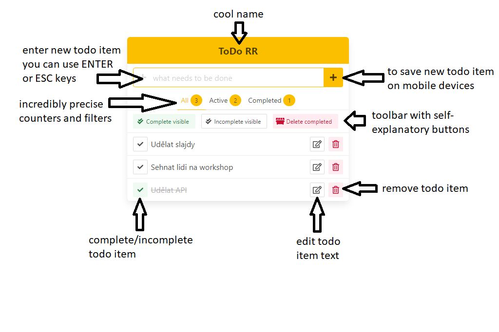

# ToDo RR

Simple ToDo app written using [React](https://reactjs.org), [Redux](https://redux.js.org), [Redux Saga](https://redux-saga.js.org) and [Reselect](https://github.com/reduxjs/reselect) with UI using [Bulma](https://bulma.io).



## Demo

You can find running demo at http://todorr.maixner.eu.

## Install

```
npm install
```

## Run

```
npm start
```

Open http://localhost:3000 in browser.

## Data

This app is using localstorage to store all data. This means, all entered data is only stored on the device you are using to display the app and is not shared anywhere.

## Features

- [x] create item
- [x] read items
- [x] update item
- [x] delete item
- [x] complete/incomplete item
- [x] filter items to all/active/completed
- [x] display number of all/active/completed
- [x] complete all visible at once
- [x] delete all completed at once
- [x] responsive
- [x] missing backend
- [x] concurrency
- [x] localstorage backend

## Ideas

- [ ] select items to complete/incomplete/delete
- [ ] tests
- [ ] searching
- [ ] sorting
- [ ] tags
- [ ] lists
- [ ] users
- [ ] dark mode
- [ ] i18n
- [ ] a11y
- [ ] IE support?
